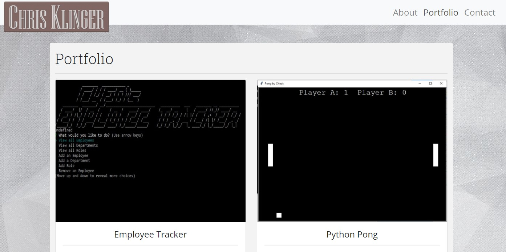

# React Portfolio&middot;  

## Deployed Site
https://chrisamk.github.io/React-Portfolio/

https://github.com/ChrisAMK/React-Portfolio

## Description 

This week's task is the re-create our Professional Portfolios using our knowledge in React, React was extremely useful when sticking to the DRY (Do not Repeat) idealology for the Portfolio Page. Instead of writing HTML for every Project in the Portfolio we only have to write one component that takes in props to distinguish itself from the others. On the same leaf we can write one Navigation bar and one Footer component have it consistent through the site. We use React Router to handle the component service.

## Table of Contents 
* [Installation](#Installation)
* [Usage](#Usage)
* [License](#License)
* [Contributions](#Contributions)
* [Tests and Examples](#Tests)
* [Questions](#Questions)

## Installation <a name='Installation'></a> 
```
Not Valid

```
## Usage <a name='Usage'></a> 
```
This is intended for Viewing only

```
## License <a name='License'></a> 
Academic Free License v3.0

[Click Here to go to License Site!](https://opensource.org/licenses/AFL-3.0)

## Questions <a name='Questions'></a> 
If there are any questions feel free to reach me at [Github](https://github.com/ChrisAMK)

or E-mail me at chriskl@live.com



